# DIADZ Themes

## Programms

Spotify: [Spicetify](https://spicetify.app/)

Discord: [Vencord](https://vencord.dev/)(Recommended, others work too e.g. [BetterDiscord](https://betterdiscord.app/)

Youtube: [Enhancer for YouTube™ Chrome](https://chrome.google.com/webstore/detail/enhancer-for-youtube/ponfpcnoihfmfllpaingbgckeeldkhle) or [Enhancer for YouTube™ Firefox (Currently unavailable)](https://addons.mozilla.org/addon/enhancer-for-youtube/) 

## Spicetify

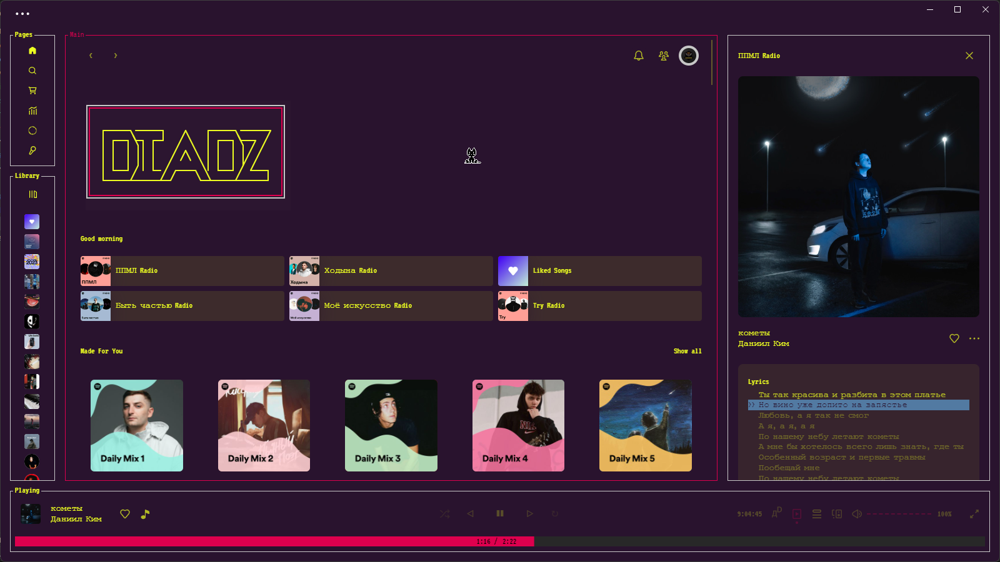

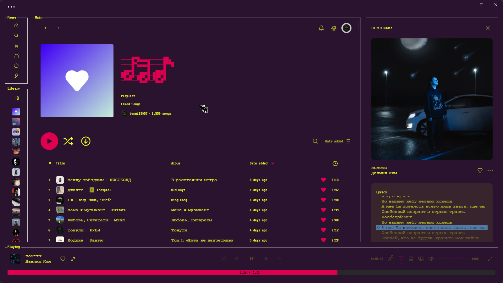

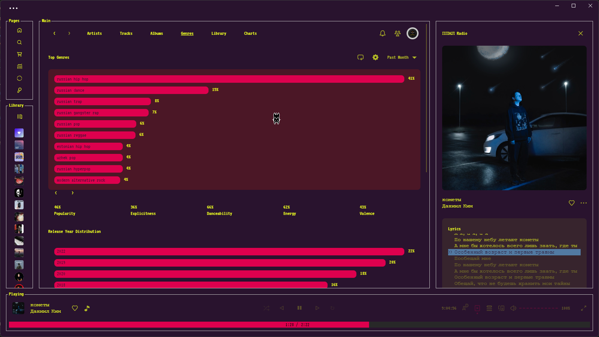
(cat not included)

-   **IMPORTANT:** Add the following to your `config-xpui.ini` file. Details as to why are explained [here](https://github.com/JulienMaille/spicetify-dynamic-theme#important). Run `spicetify apply` after adding these lines.

```ini
[Patch]
xpui.js_find_0880 = COLLAPSED\?64:32
xpui.js_repl_0880 = COLLAPSED?32:32
xpui.js_find_8008 = ,(\w+=)56,
xpui.js_repl_8008 = ,${1}32,
```

-   **SUGGESTION:** For Windows users, here's how to make the window controls' background match with the topbar background

    -   Put this snippet into your `user.css` (or through the Marketplace's `+ Add CSS` feature)

```css
/* transparent window controls background */
body::after {
    content: "";
    position: absolute;
    right: 0;
    z-index: 999;
    backdrop-filter: brightness(2.12);
    /* page zoom [ctrl][+] or [ctrl][-]
       edit width and height accordingly
        69%  = 194px 45px
        76%  = 177px 40.5px
        83%  = 162px 37.5px
        91%  = 148px 34px
        100% = 135px 31px (default)
        110% = 123px 28.5px
    */
    width: 135px;
    height: 31px;
}
```


---

## Discord

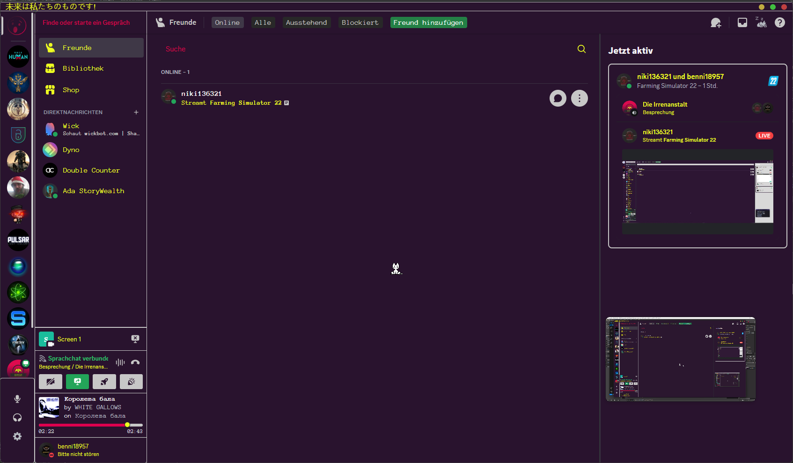

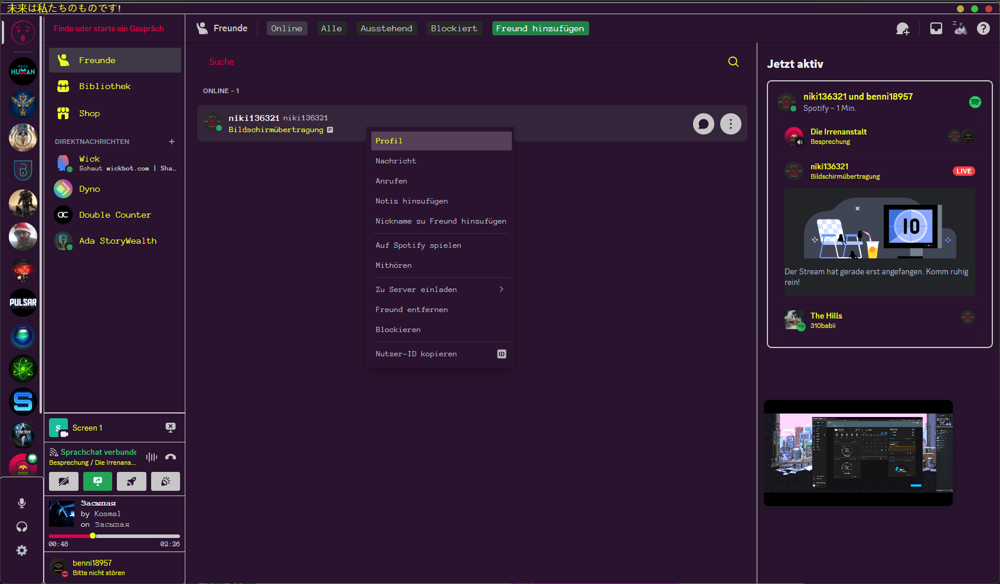

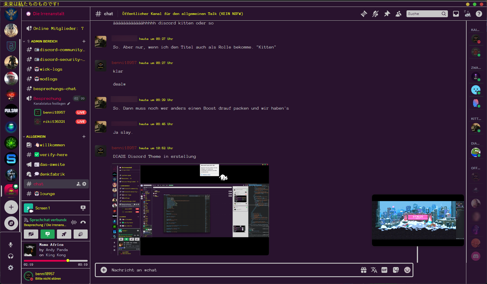

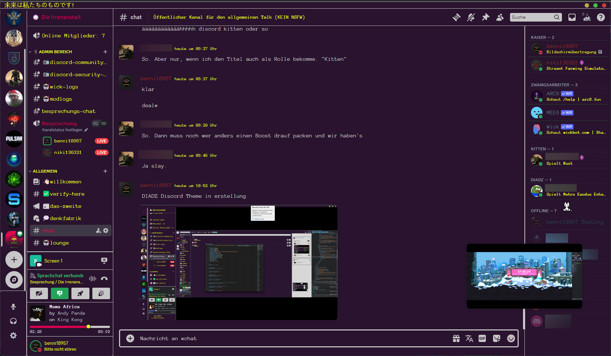
(again, cat not included)

---

## Brave/Chrome

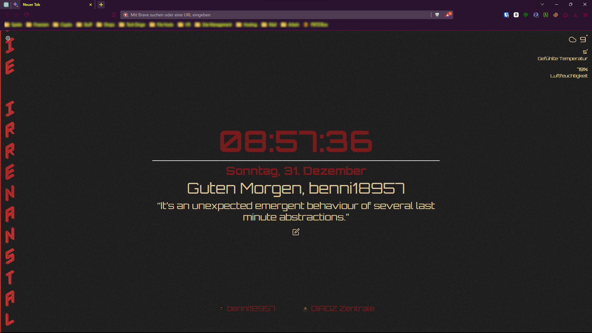

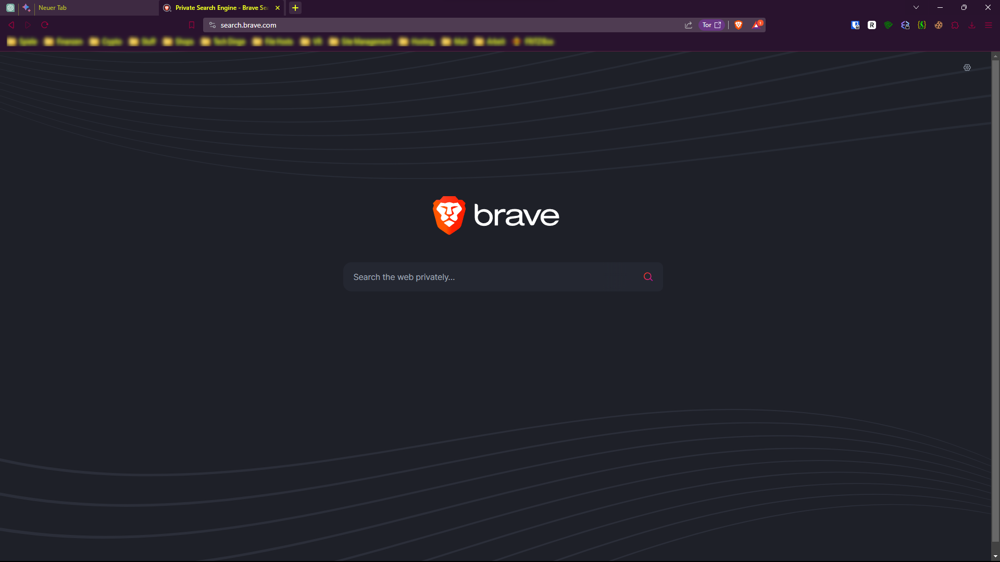

---

## Youtube

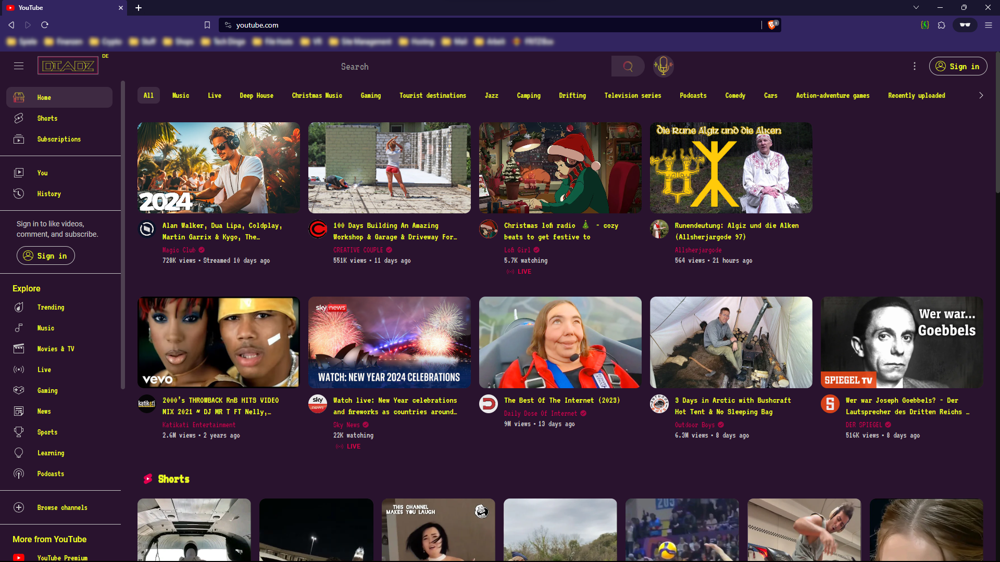

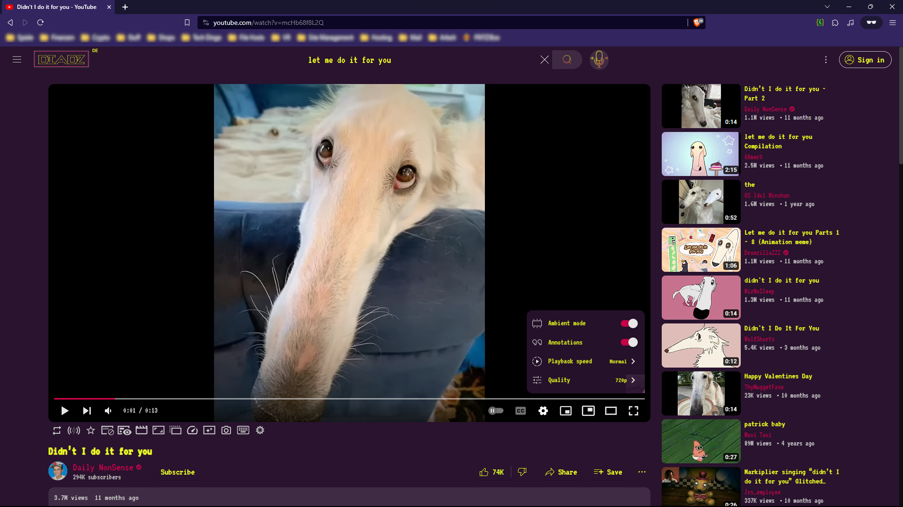

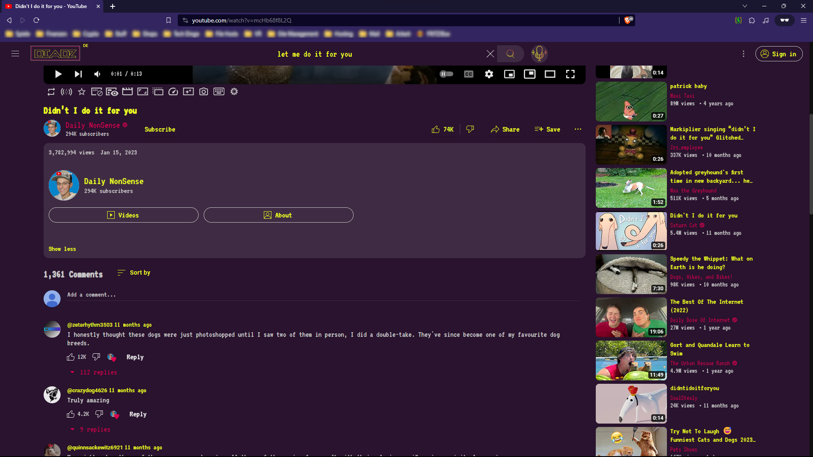

---

## Credits

[DevEvil99](https://github.com/DevEvil99) for his [Discord Theme](https://github.com/DevEvil99/Azurite-Discord-Theme)

[darkthemer](https://github.com/darkthemer/) for their [Spicetify Mimic](https://github.com/spicetify/spicetify-themes/tree/master/text) of [spotify-tui](https://github.com/Rigellute/spotify-tui)

[Lordicon](https://lordicon.com) for their awesome animated icons

---

## License

MIT License

Copyright (c) 2023 DIADZ

Permission is hereby granted, free of charge, to any person obtaining a copy of this software and associated documentation files (the "Software"), to deal in the Software without restriction, including without limitation the rights to use, copy, modify, merge, publish, distribute, sublicense, and/or sell copies of the Software, and to permit persons to whom the Software is furnished to do so, subject to the following conditions:

The above copyright notice and this permission notice shall be included in all copies or substantial portions of the Software.

THE SOFTWARE IS PROVIDED "AS IS", WITHOUT WARRANTY OF ANY KIND, EXPRESS OR IMPLIED, INCLUDING BUT NOT LIMITED TO THE WARRANTIES OF MERCHANTABILITY, FITNESS FOR A PARTICULAR PURPOSE AND NONINFRINGEMENT. IN NO EVENT SHALL THE AUTHORS OR COPYRIGHT HOLDERS BE LIABLE FOR ANY CLAIM, DAMAGES OR OTHER LIABILITY, WHETHER IN AN ACTION OF CONTRACT, TORT OR OTHERWISE, ARISING FROM, OUT OF OR IN CONNECTION WITH THE SOFTWARE OR THE USE OR OTHER DEALINGS IN THE SOFTWARE.