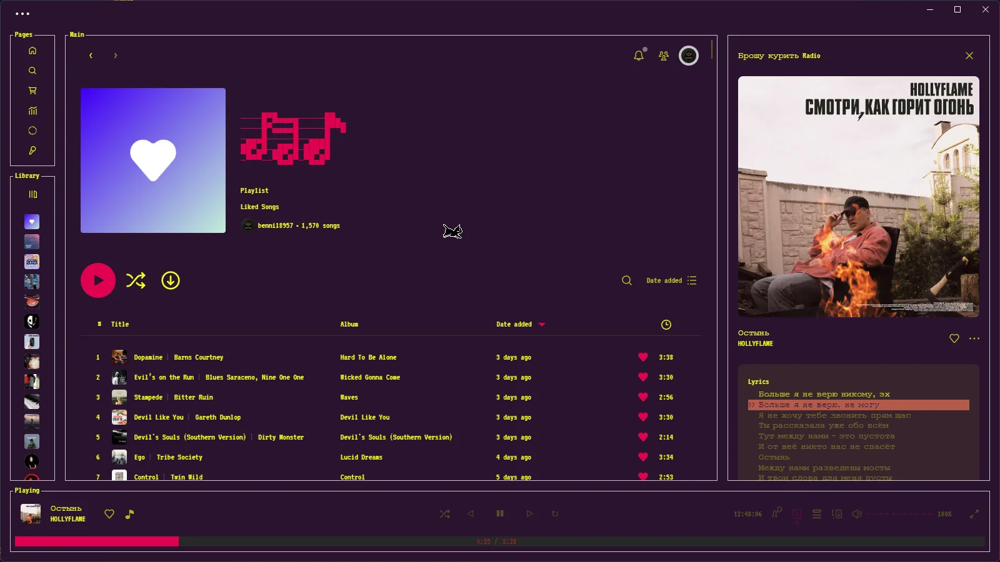
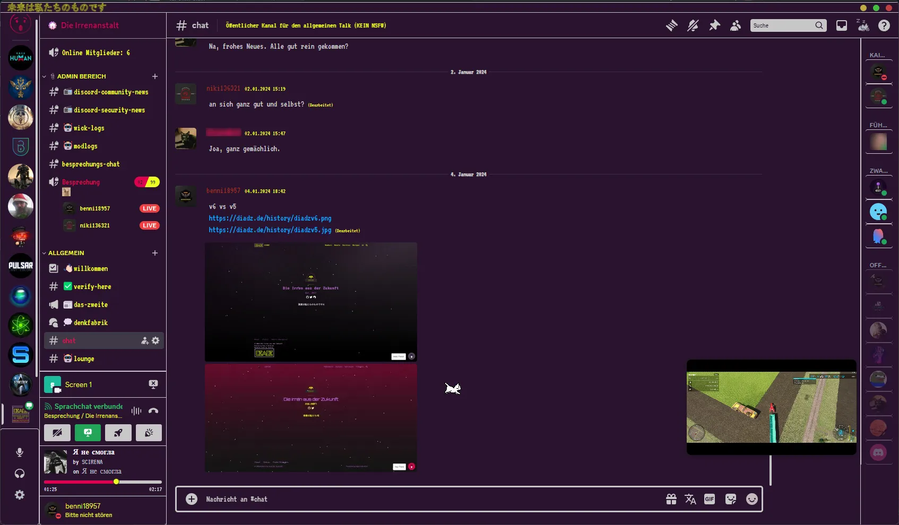
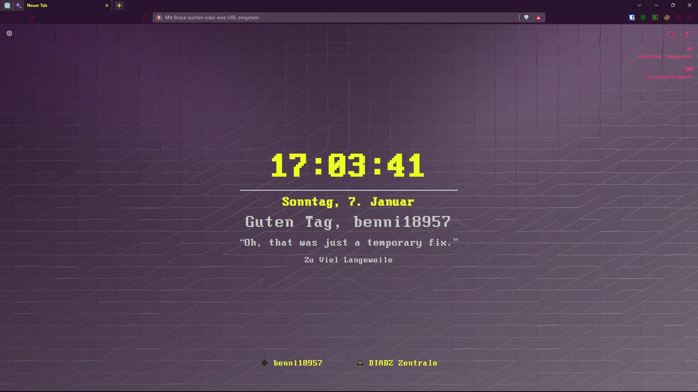
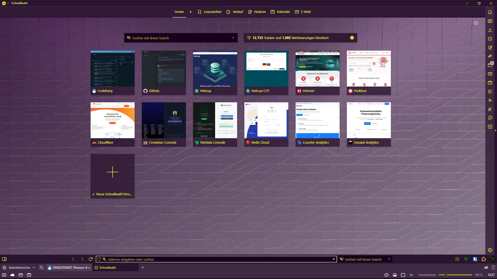
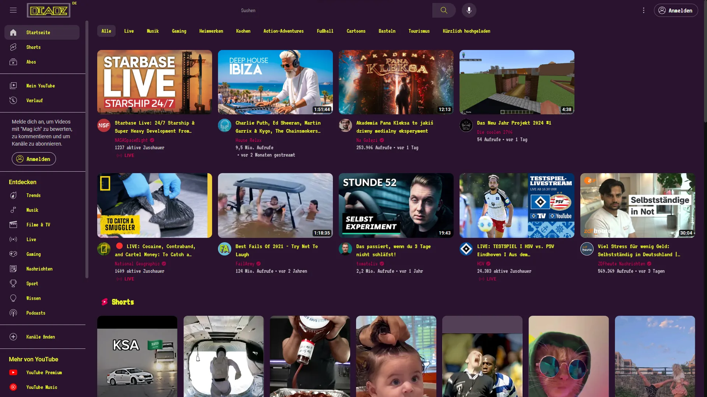
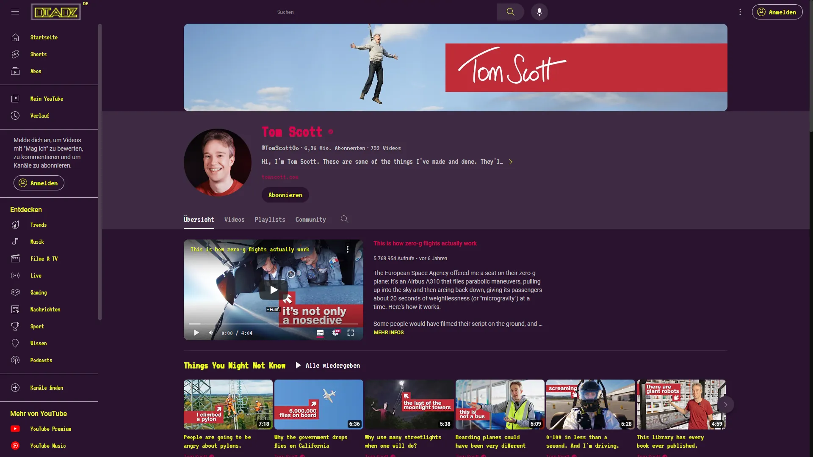
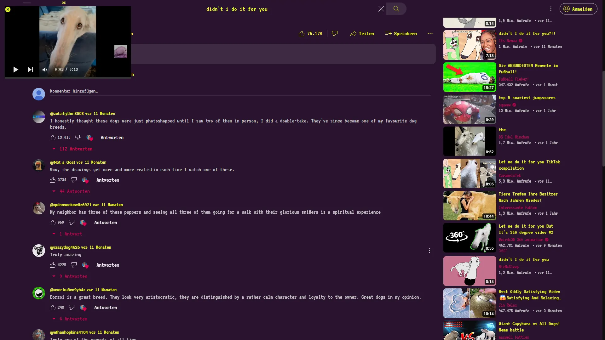
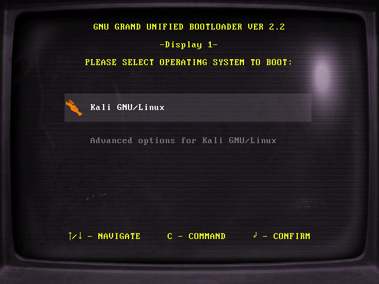
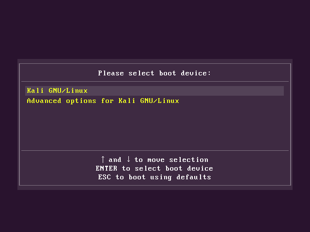

# DIADZ Themes

## Programms

Spotify: [Spicetify](https://spicetify.app/)

Discord: [Vencord](https://vencord.dev/) (Recommended, but others work too e.g. [BetterDiscord](https://betterdiscord.app/))

YouTube: [Enhancer for YouTube™](https://www.mrfdev.com/enhancer-for-youtube)

## Installation

### Spicetify

- Windows -> **PowerShell**:

```powershell
iwr -useb https://codeberg.org/DIADZ/DIADZ-Themes/raw/branch/main/scripts/spicetify/install.ps1 | iex
```

- macOS and Linux -> **Bash**:

```bash
curl -fsSL https://codeberg.org/DIADZ/DIADZ-Themes/raw/branch/main/scripts/spicetify/install.sh | sh
```

* **IMPORTANT:** Add the following to your `config-xpui.ini` file. Details as to why are explained [here](https://github.com/JulienMaille/spicetify-dynamic-theme#important). Run `spicetify apply` after adding these lines.

```ini
[Patch]
xpui.js_find_0880 = COLLAPSED\?64:32
xpui.js_repl_0880 = COLLAPSED?32:32
xpui.js_find_8008 = ,(\w+=)56,
xpui.js_repl_8008 = ,${1}32,
```

### Discord

- Ensure that you have installed a client mod like [Vencord](https://vencord.dev) or [BetterDiscord](https://betterdiscord.app)
- Download the [diadzv10-discord.css](https://codeberg.org/DIADZ/DIADZ-Themes/raw/branch/main/themes/discord/diadzv10-discord.css)
- **Vencord:** Open settings and go to Themes, Inside click on **Open Themes Folder** and place the **diadzv10-discord.css** inside of it, Click on **Load missing Themes** and enable the Theme.
- **BetterDiscord:** Same as above with the difference that you need to press ```CTRL+R``` to refresh Discord and see missing Themes

### Brave/Chrome

- Go to ```chrome://extensions``` and enable Developer mode
- Reload the extension manager page to avoid errors
- Download the [diadz-brave.zip](https://codeberg.org/DIADZ/DIADZ-Themes/raw/branch/main/themes/brave-chrome/diadzv10-brave.zip)
- Finally, Drag and drop the **diadz-brave.zip** file into the extension manager

### Vivaldi

- Download the [diadzv10-vivaldi.zip](https://codeberg.org/DIADZ/DIADZ-Themes/raw/branch/main/themes/vivaldi/diadzv10-vivaldi.zip)
- Go to settings and click on Themes
- Click on Open Theme and choose the **diadzv10-vivaldi.zip** you downloaded before
- Finally, Click on install in the pop-up window

### YouTube

- Make sure you installed [Enhancer for YouTube™](https://www.mrfdev.com/enhancer-for-youtube) and that you have enabled YouTube-DeepDark
- Finally, Open the [diadzv10.css](https://codeberg.org/DIADZ/DIADZ-Themes/raw/branch/main/themes/youtube/diadzv10.css) and paste the code inside it into the Custom theme window

## Uninstallation

### Spicetify

- Windows -> **PowerShell**:

```powershell
iwr -useb https://codeberg.org/DIADZ/DIADZ-Themes/raw/branch/main/scripts/spicetify/uninstall.ps1 | iex
```

- macOS and Linux -> **Bash**:

```bash
curl -fsSL https://codeberg.org/DIADZ/DIADZ-Themes/raw/branch/main/scripts/spicetify/uninstall.sh | sh
```

### Discord

- Go to the Theme folder and delete the .css file

### Brave/Chrome

- Go to your browsers design settings and reset them to default

### Vivaldi

- Click on the minus at the top right of the Theme preview

### YouTube

- Remove the CSS code and save

## Screenshots

### Spicetify





(cat not included)

### Discord





(again, cat not included)

### Brave/Chrome



### Vivaldi



### YouTube








### GRUB

#### DIADZ V10 CRT



---

#### DIADZ V10 OLD BIOS



## Credits

[DevEvil99](https://github.com/DevEvil99) for his [Discord Theme](https://github.com/DevEvil99/Azurite-Discord-Theme)

[darkthemer](https://github.com/darkthemer/) for their [Spicetify Mimic](https://github.com/spicetify/spicetify-themes/tree/master/text) of [spotify-tui](https://github.com/Rigellute/spotify-tui)

[Lordicon](https://lordicon.com) for their awesome animated icons

Me [benni18957](https://benni18957.de) for creating the backgrounds and logos for DIADZ

## License

The project itself is licensed under the [MIT](LICENSE) license, and the images and logos owned by [DIADZ](https://diadz.de) are licensed under the [Creative Commons Attribution-NonCommercial 4.0 International](https://creativecommons.org/licenses/by-nc/4.0/) license.
